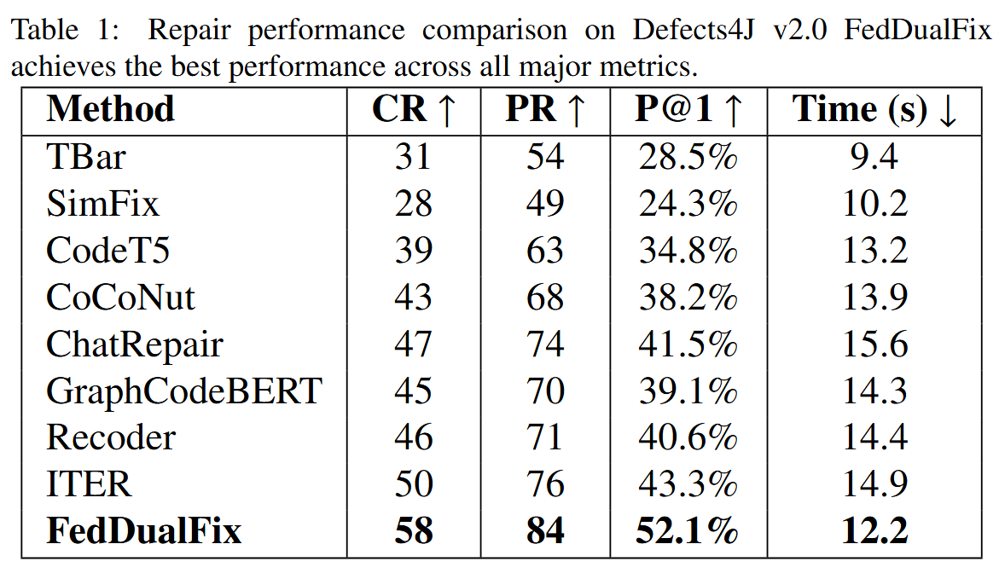
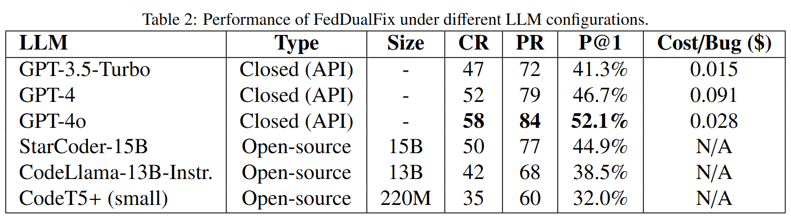
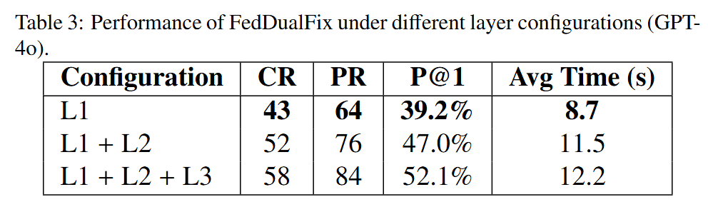
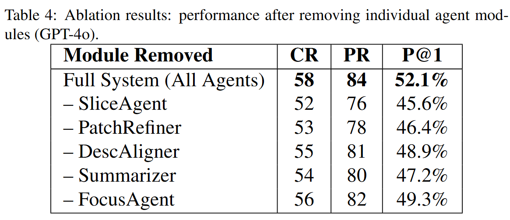
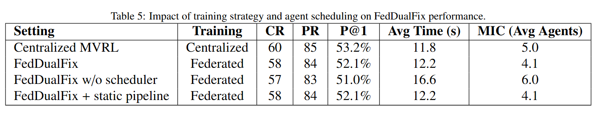

# FedDualFix：A Federated Multi-Agent Framework for Dual-Modality Vulnerability Repair

This is the source code to the paper "FedDualFix：A Federated Multi-Agent Framework for Dual-Modality Vulnerability Repair". Please refer to the paper for the experimental details.

# Approach

# Data preprocessing
You can download the preprocessed dataset from here and place it under data/.
(Optional) To rebuild from raw Defects4J, run: bash scripts/make_info_bulk.sh (outputs to data/d4j/info/).
For details, see data/README.md.

# Requirements
Python 3.10+
pip install -r requirements.txt (core: openai, google-generativeai, retry, pyyaml, javalang, apted)
(Optional) Docker + Defects4J or local JDK 8/11 for tests
API keys: OpenAI (or proxy), Gemini; (optional) Tavily for web hints

# About the experimental results in the paper:
We provide a brief analysis of RQ.
If you want to see more detail, please see the paper.

1. The purpose of RQ1 is to demonstrate the competitiveness of our proposed method FedDualFix, compared to current state-of-the-art APR baselines.

2. In RQ2, we assess FedDualFix's portability across different LLM back-ends, quantifying the impact of model choice/size on repair quality and cost..

3. In RQ3, we firet isolate the contribution of each agent layer—L1 Fast-Repair, L2 Structure-Aware, and L3 Feedback-Refine—via layer-wise ablations and early-exit analysis, measuring changes in P@1 and latency..

Second we evaluate specialized modules within the hierarchy (RepoFocus, Summarizer/Slicer, DescAligner, PatchRefiner), reporting their incremental gains and failure modes.

4. In this RQ, we analyze federated training and confidence-guided agent scheduling, showing their effects on repair effectiveness, communication cost, and coordination efficiency across clients.

